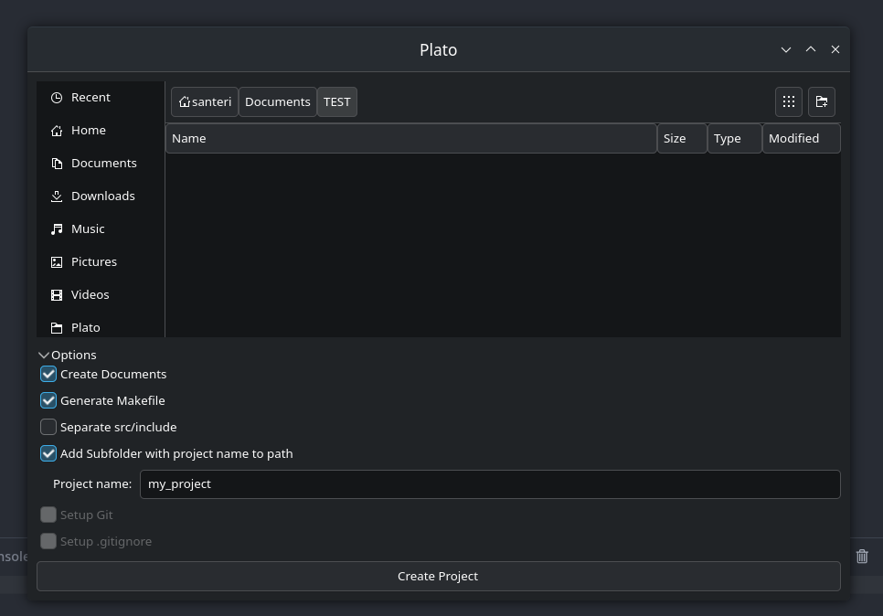

# Plato

Plato is a small GTK4 desktop app that generates a starter C++ project structure.

## What `plato` does

- Lets you pick a destination folder from a GUI.
- Creates a C++ project skeleton in that location.
- Can optionally generate:
  - `include/` (separate `src/include` layout)
  - `documentation/README.md`
  - `Makefile`
  - a subfolder named after your project

## Build And Run (CMake)

Plato uses the `CMakeLists.txt` in this repo and links against `gtkmm-4.0`.

### Requirements

- CMake 3.20+
- C++20 compiler (`g++` or `clang++`)
- `pkg-config`
- `gtkmm-4.0` development package

### Commands

```bash
cmake -S . -B build
cmake --build build
./build/plato
```

Rebuild from scratch:

```bash
rm -rf build
cmake -S . -B build
cmake --build build
./build/plato
```

## How To Use Plato

1. Launch the app:
   ```bash
   ./build/plato
   ```
2. Choose the folder where you want the project created.
3. Open **Options** and select what you want generated.
4. If **Add Subfolder with project name to path** is enabled, enter a project name.
5. Click **Create Project**.

## Generated Output (Example)

Depending on selected options, Plato creates files like:

- `src/main.cpp`
- `build/`
- `include/` (optional)
- `documentation/README.md` (optional)
- `Makefile` (optional)

## Quick Rundown Of `.cpp` Files

- `src/main.cpp`  
  Entry point. Starts the GTK application and opens the main window.

- `src/window.cpp`  
  Builds the UI, handles option toggles, validates form input, and sends a project creation request.

- `src/project_generator.cpp`  
  Creates the target directories/files on disk based on selected options.

## Notes

- `Setup Git` and `Setup .gitignore` UI options are present in the code but currently disabled in the window logic.

## Screenshots

